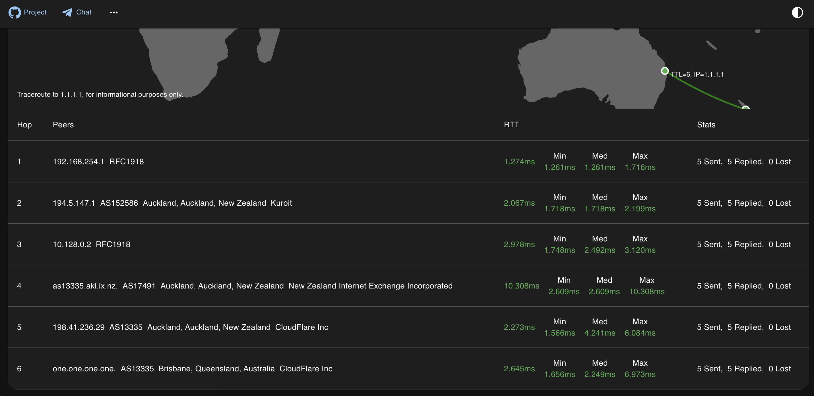
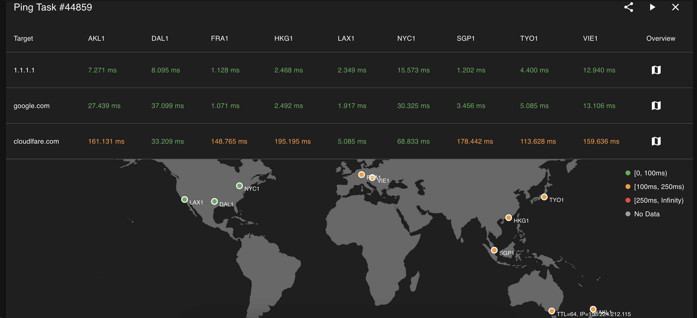
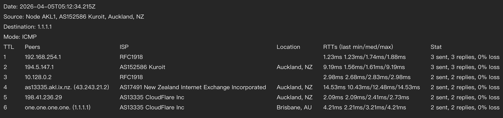
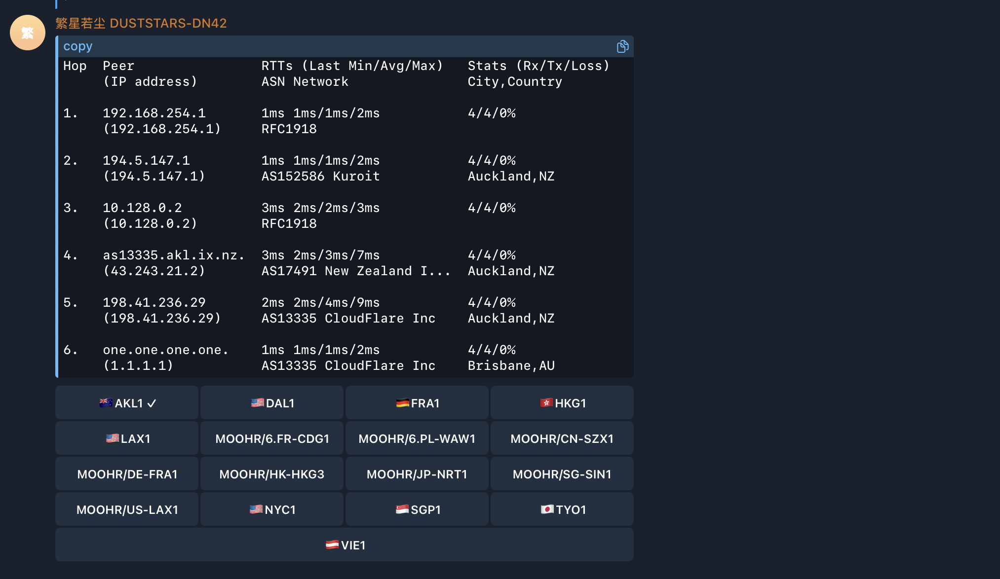

# CloudPing

[](https://github.com/internetworklab/cloudping/actions/workflows/build.yml)

CloudPing is a web-based ping and traceroute tool that provides an easy-to-use interface, giving users an intuitive view of network information such as how IP packets are routed and what the round-trip latency looks like. We believe that making these network tracing and diagnostic capabilities available via the cloud is a great idea — hence the name "CloudPing".

## Features

- Ping, Traceroute (UDP flavor or ICMP flavor)
- TCP Ping
- DNS Probe (UDP, TCP, RFC7858 DoT, RFC8484 DoH)
- HTTP Probe (HTTP/1.1, HTTP/2 and HTTP/3)
- DN42 Dual Stack support, Internet support
- Basic IP information display (like ASN, Country, and probably Lat Lon)
- API-first design, CLI friendly (can be access through http clients like `curl`)
- QUIC for hub-agent communication support and NAT-traversal
- JWT authentication
- Telegram Bot (currently supports: `/ping`, `/traceroute`, docs are on the way)
- Prometheus Metrics

## Try

If you are in a hurry, just go straight to try our deployed instance at [here](https://ping2.sh), or [here](http://ping.dn42)(DN42). Which is ready to use, and doesn't require you to build or install anything.

Telegram Bot service is available via [@as4242421771_bot](http://t.me/as4242421771_bot).

## Build

Make sure golang of newer version is already installed, if not, go visit [go.dev/doc/install](https://go.dev/doc/install) to download and un-tar a tarball, and make sure that $GOPATH/bin, and /usr/local/go/bin are in the $PATH.

```shell
git clone https://github.com/internetworklab/cloudping
cd cloudping
./buildversion.sh # to generate version metadata dependence
go build -o bin/globalping ./cmd/globalping
```

Now the binary `bin/globalping` can serve as an agent or a hub depending on the CLI arguments provided.

## Debugging

For how to generate self-signed certs (and CA) for testing, see [Notes.md](./Notes.md).

After the binary is built, to see how it goes, try launch a testing purpose localhost agent:

Open a terminal window, launch the testing hub in foreground:

```shell
scripts/launch_example_clustered_hub.sh
```

Then open one or more terminal winodws, launch the testing agent(s) in foreground:

```shell
scripts/launch_example_clustered_agent_1.sh # ls scripts/*.sh to see all
```

It binds on 127.0.0.1:8084, listens for plaintext HTTP requests, you can call the API with whaever HTTP client you like, for example:

```shell
curl --url-query targets=1.1.1.1 --url-query count=3 localhost:8084/simpleping
```

Doing so cause it send out 3 icmp echo request packets to the destination specified, 1.1.1.1, and the response will be stream to stdout in realtime in JSON line format.

It's better to use the web UI directly, since it has much richer feature set as well as easier to use UI.

## Screenshots

Currently the looking is still rugged, but we are actively iterating it.









## API Design

### Endpoints Overview

| Component | Endpoint | Method | Target Parameter | Targets Supported |
|-----------|----------|--------|------------------|-------------------|
| Agent | `/simpleping` | GET | `destination` | Single target |
| Hub | `/ping` | GET | `targets` | Multiple (comma-separated) |

Port numbers are configured via command-line arguments.

### Request Format

Parameters are encoded as URL search params. For available parameters and their effects, see:
- [pkg/pinger/request.go](pkg/pinger/request.go) - Supported parameters
- [pkg/pinger/ping.go](pkg/pinger/ping.go) - Parameter effects

**Example (curl):**

Bring up the testing hub and agent(s) as described in the [Debugging](##Debugging) section

```shell
# Agent
curl --url-query targets=1.1.1.1 --url-query count=3 localhost:8085/simpleping

# Hub
curl --url-query from=us-lax1 --url-query targets=1.1.1.1 --url-query count=3 localhost:8084/ping
```

> Note: `--url-query` is curl syntax sugar for encoding URL search params.

**Prometheus Metrics:**

Agents can expose Prometheus metrics by setting `--metrics-listen-address` (e.g. `:2112`). The metrics path defaults to `/metrics`.

```shell
# Agent (requires --metrics-listen-address to be set when launching the agent)
curl localhost:2112/metrics
```

### Response Format

Both endpoints return a stream of JSON lines. Use line feed (`\n`) as the delimiter.

### Authentication

| Endpoint | Authentication |
|----------|----------------|
| Agent (`/simpleping`) | mTLS (client certificate required) |
| Hub (`/ping`) | JWT token |

For certificate configuration, run `bin/globalping agent --help` or `bin/globalping hub --help`.

### Developer Note

These APIs are intended for developers only. End users should use the Web UI.

## Deployment

### Web (frontend)

The Web UI is built with Next.js and supports the following build-time environment variables:

| Variable | Description | Default (Example) |
|----------|-------------|-------------|
| `NEXT_PUBLIC_API_ENDPOINT` | API endpoint to use (prefix prepended to every request path) | `/api` |
| `NEXT_PUBLIC_GITHUB_REPO` | Link to the repository website | [internetworklab/cloudping](https://github.com/internetworklab/cloudping) |
| `NEXT_PUBLIC_TG_INVITE_LINK` | Invite link for the Telegram discussion group | Just a URL |
| `NEXT_PUBLIC_SITE_NAME` | WebUI title for self-hosted deployments | `CloudPing` |
| `NEXT_PUBLIC_DEFAULT_RESOLVER` | Resolver to specify in every probe request send to backend | `127.0.0.11:53` |

These variables are evaluated at build time and embedded into the frontend bundle.

### Full Deployment (Docker Compose)

A complete self-hosted deployment example is available under [`docker/example1/`](docker/example1/). It includes a [`docker-compose.yaml`](docker/example1/docker-compose.yaml) that brings up all components — web frontend (Caddy), hub, Telegram bot, probe agents, and a Cloudflare Tunnel (`cloudflared`) for public ingress — along with setup scripts for provisioning tunnels, DNS records, and self-signed mTLS certificates for securing hub-to-agent's bidirectional communication.

> **Note:** This is intended as a hands-on demonstration, not a production-ready setup, for a production setup, the agents should be deployed at where they actually are.

For step-by-step instructions, see [`docker/example1/README.md`](docker/example1/README.md).

## Join Agent

To run your cloudping agent and join our cluster, prepare three files:

docker-compose.yaml:

```
networks:
  globalping:
    name: globalping
    enable_ipv6: false
    ipam:
      driver: default
      config:
        - subnet: "${SUBNET_OVERRIDE}"
services:
  agent:
    container_name: globalping-agent
    pull_policy: always
    image: ghcr.io/internetworklab/cloudping:${VERSION}
    working_dir: /app/globalping
    networks:
      - globalping
    volumes:
      - "./.env.inside:/app/globalping/.env:ro" # .env.inside has some sensitive data, such as apikeys for invoking third-party services.
    command:
      - "/usr/local/bin/globalping"
      - "agent"
      - "--node-name=${NODE_NAME}"
      - "--exact-location-lat-lon=${EXACT_LOCATION_LAT_LON}"
      - "--country-code=${ALPHA2}"
      - "--city-name=${CITY}"
      - "--asn=${ASN}"
      - "--isp=${ISP}"
      - "--dn42-asn=${DN42_ASN}"
      - "--dn42-isp=${DN42_ISP}"
    mem_limit: 256m
```

.env:

```
NODE_NAME=someone/de-nue1
SUBNET_OVERRIDE=192.168.253.0/30
EXACT_LOCATION_LAT_LON=48.1952,16.3503
VERSION=latest
ALPHA2=DE
CITY=Nuremberg
ASN=AS197540
ISP=netcup GmbH
DN42_ASN=AS4242421234
DN42_ISP=YOUR-DN42-AS
```

Just don't forget to replace the informations in `.env` with that of yours, such as node name (node name must not be conflict with current node names), locations and ASNs.

.env.inside:

```
JWT_TOKEN=<jwt_token>
```

Grab the JWT token from bot [@as4242421771_bot](http://t.me/as4242421771_bot), with command `/token`.

## Credits

Thanks the following GeoIP datasources, in no particular order:

- [dn42-geoip](https://github.com/Xe-iu/dn42-geoip)
- [IP2Location](https://www.ip2location.io/)
